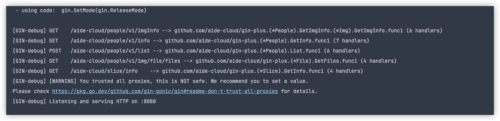

# gin plus

> 用于对gin框架增强, 实现根据结构体+结构体方法名实现路由注册

## 安装

```shell
go get -u github.com/aide-cloud/gin-plus
```

## 使用

```go
package main

import (
	"log"

	ginplush "github.com/aide-cloud/gin-plus"

	"github.com/gin-gonic/gin"
)

type People struct {
}

func (p *People) GetInfo() gin.HandlerFunc {
	return func(ctx *gin.Context) {
		ctx.String(200, "GetInfo")
	}
}

func (p *People) Middlewares() []gin.HandlerFunc {
	return []gin.HandlerFunc{
		func(context *gin.Context) {
			log.Println("middleware1")
		},
		func(context *gin.Context) {
			log.Println("middleware2")
		},
	}
}

func main() {
	r := gin.Default()
	ginInstance := ginplush.New(r, ginplush.WithControllers(&People{}))
	ginInstance.Run(":8080")
}

```

## 自定义

```go
package main

import (
	"log"
	
	ginplush "github.com/aide-cloud/gin-plus"
	
	"github.com/gin-gonic/gin"
)

// People controller, 会根据该controller的方法名注册路由
type People struct {
	// 内联controller, 方法注册到父级
    *Img 
}

// Img controller, 会根据该controller的方法名注册路由
type Img struct {
    File *File
}

// File controller, 会根据该controller的方法名注册路由
type File struct {
}

// GetImgInfo Get /imgInfo
func (l *Img) GetImgInfo() gin.HandlerFunc {
    return func(ctx *gin.Context) {
        ctx.String(200, "GetInfo")
    }
}

// GetFiles Get /files
func (l *File) GetFiles() gin.HandlerFunc {
    return func(ctx *gin.Context) {
		ctx.String(200, "GetFiles")
    }
}

// GetInfo Get /info
func (p *People) GetInfo() gin.HandlerFunc {
    return func(ctx *gin.Context) {
        ctx.String(200, "GetInfo")
    }
}

// List Get /list
func (p *People) List() gin.HandlerFunc {
    return func(ctx *gin.Context) {
        ctx.String(200, "List")
    }
}

// Middlewares 模块下公共中间件
func (p *People) Middlewares() []gin.HandlerFunc {
    return []gin.HandlerFunc{
        func(context *gin.Context) {
            log.Println("middleware1")
        },
        func(context *gin.Context) {
            log.Println("middleware2")
        },
    }
}

// BasePath People模块下公共路由前缀
func (p *People) BasePath() string {
    return "/people/v1"
}

// MethoderMiddlewares People各个方法的中间件
func (p *People) MethoderMiddlewares() map[string][]gin.HandlerFunc {
    return map[string][]gin.HandlerFunc{
        "GetInfo": {
            func(ctx *gin.Context) {
                log.Println("GetInfo middleware1")
            },
        },
    }
}

type Slice []string

func (l *Slice) Middlewares() []gin.HandlerFunc {
    return nil
}

func (l *Slice) GetInfo() gin.HandlerFunc {
    return func(ctx *gin.Context) {
        ctx.String(200, "GetInfo")
    }
}

func main() {
    r := gin.Default()
    opts := []ginplush.Option{
        // 注册全局路由
		ginplush.WithMiddlewares(func(ctx *gin.Context) {
            log.Println("main middleware")
        }),
        // 设置基础的路由前缀, 会在每个路由前面加上该前缀
		ginplush.WithBasePath("aide-cloud"),
		// 设置路由前缀, 只识别这个列表的函数, 其他函数统一以defaultHttpMethod为http方法注册
		ginplush.WithHttpMethodPrefixes(ginplush.Get, ginplush.Post),
        // 无前缀的函数默认使用的http方法
		ginplush.WithDefaultHttpMethod(ginplush.Post),
		// 路由controller, 会根据该controller的方法名注册路由
		ginplush.WithControllers(&People{
            Img: &Img{
                File: &File{},
            },
        }, &Slice{}),
    }
    ginInstance := ginplush.New(r, opts...)
    ginInstance.Run(":8080")
}
```

* 运行截图



